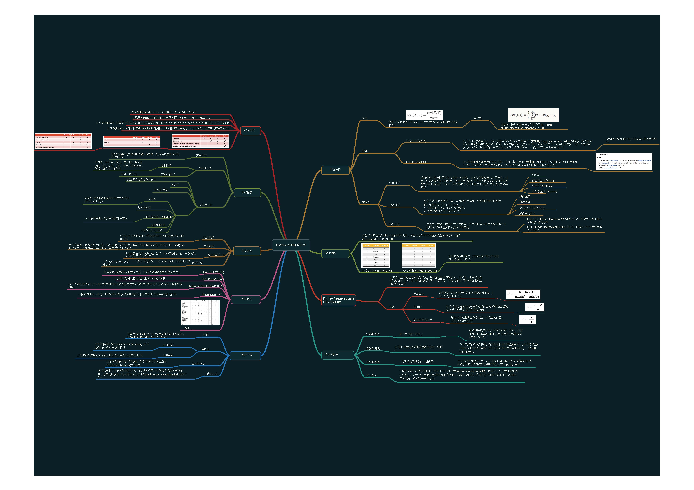

# machine-learning-mindmap-cn

本项目是在[Daniel Formoso](https://github.com/dformoso)的github项目[machine-learning-mindmap](https://github.com/dformoso/machine-learning-mindmap)基础之上进行翻译，除原英文的翻译外，我又额外添加了一些补充说明以及更易于中国人理解的说明标注。对于一些不易理解、有争议性的概念均添加了引用链接，大家可以自行求证。如有发现翻译纰漏或更好的建议，欢迎与caiyongji联系。

> TIPS: 图片略大，请耐心等待或直接下载。

# 机器学习-数据处理

# 机器学习-概念

# 机器学习-处理

# 机器学习-算法

# 机器学习模型 & 神经网络模型

### 关注公众号查看mindmap文本翻译、注释、说明及引用 ###

